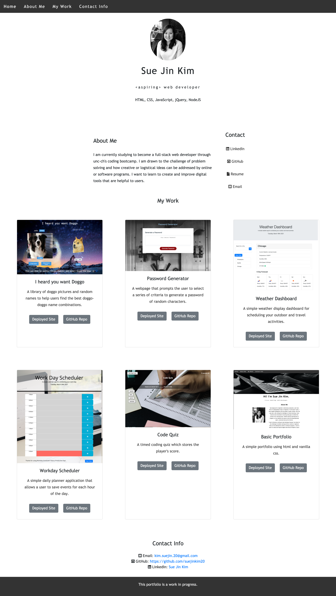

# revised-portfolio
Ongoing work in project, this portfolio has been built using HTML and CSS.

## Description
This website has been created using HTML, CSS, and Bootstrap.

* Developer's name, recent photo are presented
* Links to sections about the developer, the developer's work, and how to contact the devloper are displayed in a navigation bar
* Navigation links scroll to corresponding sections
* The image for the first application is larger in size than the other application images
* Images for existing applications contain links to the deployed application
* Responsive layout adapts to the user's viewport when resized or viewed on various screens or devices

Issues that are still being addressed: 
* Continuing to experiment with the layout of the page to optimize responsive design
    * Specifically, making the heights/sizes of the portfolio images adjust flexibly in addition to the widths.

Notes to self:
* Include collaboration work (and other soft skills) with assistants/coaches/PLCs
* Need to consolidate verbiage on LinkedIn
* Add Coursera certifications

## Usage
This website is a portfolio website intended to showcase the website developer's work and information. The website is deployed at the following link: https://suejinkim20.github.io/revised-portfolio/

The following screenshots show the website on a web browser.

## Credits

* Tutorials used:
    * https://www.w3schools.com/html/default.asp
    * https://www.w3schools.com/css/default.asp
* Free Images from: https://www.upsplash.com
    * project 1 photo: https://images.unsplash.com/photo-1518226203301-8e7f833c6a94?ixid=MXwxMjA3fDB8MHxwaG90by1wYWdlfHx8fGVufDB8fHw%3D&ixlib=rb-1.2.1&auto=format&fit=crop&w=1267&q=80
    * project 2 photo: https://images.unsplash.com/photo-1522032662723-6649e699785f?ixlib=rb-1.2.1&ixid=MXwxMjA3fDB8MHxwaG90by1wYWdlfHx8fGVufDB8fHw%3D&auto=format&fit=crop&w=1950&q=80
* Responsive Nav: https://www.w3schools.com/howto/howto_js_topnav_responsive.asp
* Resizing Background Images: https://developer.mozilla.org/en-US/docs/Web/CSS/CSS_Backgrounds_and_Borders/Resizing_background_images

## Licensing

MIT License

Copyright (c) [2021] [Sue Jin Kim]

Permission is hereby granted, free of charge, to any person obtaining a copy of this software and associated documentation files (the "Software"), to deal in the Software without restriction, including without limitation the rights to use, copy, modify, merge, publish, distribute, sublicense, and/or sell copies of the Software, and to permit persons to whom the Software is furnished to do so, subject to the following conditions:

The above copyright notice and this permission notice shall be included in all copies or substantial portions of the Software.

THE SOFTWARE IS PROVIDED "AS IS", WITHOUT WARRANTY OF ANY KIND, EXPRESS OR IMPLIED, INCLUDING BUT NOT LIMITED TO THE WARRANTIES OF MERCHANTABILITY, FITNESS FOR A PARTICULAR PURPOSE AND NONINFRINGEMENT. IN NO EVENT SHALL THE AUTHORS OR COPYRIGHT HOLDERS BE LIABLE FOR ANY CLAIM, DAMAGES OR OTHER LIABILITY, WHETHER IN AN ACTION OF CONTRACT, TORT OR OTHERWISE, ARISING FROM, OUT OF OR IN CONNECTION WITH THE SOFTWARE OR THE USE OR OTHER DEALINGS IN THE SOFTWARE.

